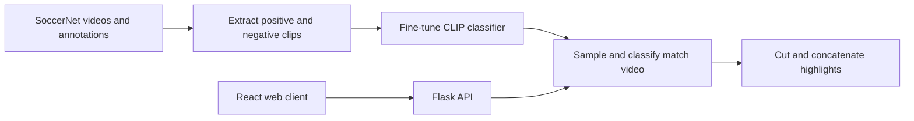

# Football Highlight Generator

An end-to-end football (soccer) highlight generator built with a fine-tuned CLIP image classifier. The system samples match footage once per second, identifies likely shots on target or goals, and assembles the detected moments into a highlight video.

The repository includes the complete workflow: SoccerNet data preparation, model training and evaluation, video inference, and a Flask + React web application.

## Features

- Fine-tuned `CLIP ViT-B/32` classifier for shot / non-shot frame classification.
- SoccerNet annotation parsing for `shots on target` and `goal` events.
- Automated positive and negative video-clip extraction with FFmpeg.
- Batched, once-per-second video inference and automatic highlight assembly.
- Web interface for uploading a match, tracking progress, previewing, and downloading the generated result.
- Supports MP4, AVI, MOV, MKV, and WMV uploads up to 1 GB.

## Pipeline



## Repository Layout

```text
.
├── app/
│   ├── backend.py            # Flask API and asynchronous processing
│   └── frontend/             # React upload interface
├── data_processing/
│   ├── label_parser.py       # SoccerNet annotation parsing and clip extraction
│   └── video_utils.py        # PyTorch dataset implementation
├── model/
│   ├── model.py              # FineTunedCLIP definition
│   ├── train.py              # Production-model training script
│   ├── evaluate.py           # Test-split evaluation script
│   └── inference.py          # HighlightGenerator inference entry point
├── config.py                 # Centralized, environment-overridable paths
├── data_download.py          # SoccerNet download helper
└── requirements.txt
```

## Prerequisites

- Python 3.9 or later
- Node.js 16 or later and npm 8 or later
- [FFmpeg](https://ffmpeg.org/) and `ffprobe` available on `PATH`
- Optional: a CUDA-capable GPU for faster training and inference

## Installation

```powershell
git clone https://github.com/jockylover/football-highlight-generator.git
cd football-highlight-generator

python -m venv .venv
.\.venv\Scripts\Activate.ps1
pip install -r requirements.txt
```

The CLIP package is installed from GitHub. If it does not install with `requirements.txt`, install it separately:

```powershell
pip install git+https://github.com/openai/CLIP.git
```

Install the frontend dependencies:

```powershell
cd app\frontend
npm install
```

## Data and Model Weights

Datasets, videos, and trained `.pth` checkpoints are intentionally excluded from Git because of their size. Before training or inference, provide the required files yourself.

```text
data/
├── SoccerNet/                # Downloaded match videos and Labels-v2.json
└── clips/
    ├── train/{shot,non_shot}/
    ├── valid/{shot,non_shot}/
    └── test/{shot,non_shot}/

model/
├── best_model_*.pth          # Trained model checkpoint
└── best_threshold.json        # Optional threshold selected on validation data
```

All paths are defined in `config.py` and can be overridden with environment variables. This avoids editing source code when running the project on another machine.

```powershell
$env:PAPER_ROOT = (Get-Location).Path
$env:MODEL_PATH = "E:\path\to\best_model.pth"
```

You can also set `DATA_ROOT`, `SOCCERNET_DIR`, and `MODEL_DIR` individually. Place `best_threshold.json` next to the model checkpoint to use its validation-selected threshold; otherwise inference falls back to `0.5`.

## Usage

Run the following commands from the repository root unless otherwise noted.

### 1. Download data and create clips

`data_download.py` currently downloads training annotations by default. Uncomment the relevant lines in that script to download videos or other splits.

```powershell
python data_download.py
python data_processing\label_parser.py
```

For each `shots on target` or `goal` annotation, the clip-generation script creates a five-second positive sample. It also samples negative clips at least ten seconds away from an annotated event.

### 2. Train and evaluate

```powershell
python model\train.py
python model\evaluate.py
```

Training produces a timestamped checkpoint, `best_threshold.json`, and training/validation plots. The scripts write these artifacts to the current working directory, so move the checkpoint and threshold file to the desired model directory, or point `MODEL_PATH` at the checkpoint before inference.

### 3. Run the web application

Start the backend and frontend in separate terminals.

```powershell
# Terminal 1 — repository root
python app\backend.py

# Terminal 2 — app/frontend
npm start
```

The React app runs at `http://localhost:3000`; the Flask API runs at `http://localhost:5000`.

### 4. Run inference from Python

```python
from model.inference import HighlightGenerator

generator = HighlightGenerator(model_path=r"E:\path\to\best_model.pth")
shot_times = generator.detect_shots("match.mp4")
generator.generate_highlight("match.mp4", shot_times, "highlight.mp4")
```

`detect_shots` samples one frame per second and runs classification in batches. `generate_highlight` merges nearby detections, includes context around each event, and writes an MP4 file with FFmpeg.

## API Endpoints

| Method | Endpoint | Description |
| --- | --- | --- |
| `POST` | `/upload` | Upload a match video using the `video` form field. |
| `GET` | `/status/<video_id>` | Retrieve asynchronous processing status. |
| `GET` | `/download/<video_id>` | Download the generated highlight video. |
| `GET` | `/health` | Check API health. |
| `GET` | `/list` | List jobs held by the current server process. |
| `GET` | `/stats` | Retrieve current processing and storage statistics. |

Uploaded files, generated videos, and logs are cleaned up after 24 hours. Job status is stored in memory and is therefore reset when the backend restarts.

## Notes and Limitations

- This is a single-frame visual classifier, not a temporal action-recognition model.
- The positive class covers shots on target and goals, so the output is a set of candidate shot highlights rather than every possible exciting event in a match.
- Videos must contain usable video and audio streams for the current FFmpeg concatenation path. Re-encode problematic inputs before processing them.
- A GPU is strongly recommended for practical training and faster inference.

## Dataset

This project uses [SoccerNet](https://www.soccer-net.org/). Please follow the dataset's access terms and citation requirements when using its data.
